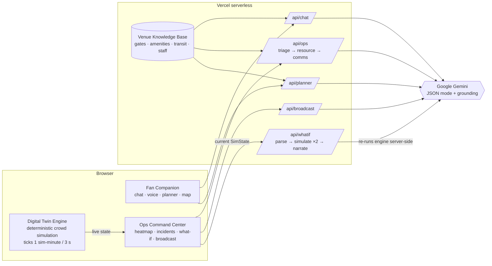

<div align="center">

# ⚽ StadiumIQ

### One stadium. 82,500 fans. Zero chaos.

**A GenAI copilot for FIFA World Cup 2026 stadiums — a multilingual companion for every fan, and an agentic command center for the people keeping them safe.**


**🔴 Live demo:** [stadiumiq-bice.vercel.app](https://stadiumiq-bice.vercel.app)

*Built for Hack2Skill PromptWars · Challenge 4: Smart Stadiums & Tournament Operations*

</div>

---

## The problem

The 2026 World Cup is the biggest tournament ever staged: 48 nations, 104 matches, stadiums of 80,000+ fans who speak dozens of languages — most of them in a venue they've never set foot in. Meanwhile, operations teams make second-by-second decisions about crowd flow, incidents, and communication where a slow or wrong call becomes a safety event.

Today those two worlds run on static signage, one-language PA announcements, and operator intuition.

## The solution

**StadiumIQ** puts a GenAI decision layer over both sides of the stadium:

| 🙋 Fan Companion | 🎛️ Ops Command Center |
|---|---|
| Chat **or speak** in any language — AI detects it and answers in kind | Live sector heatmap fed by a crowd **digital twin** |
| Venue-grounded answers (gates, food, prayer rooms, first aid) with **live map highlighting** | **Agentic incident pipeline**: 3 AI agents triage → allocate staff → draft comms |
| Accessibility-first: easy-read mode, high-contrast, wheelchair routes, sensory room info | **What-If simulator**: "close Gate B?" → twin re-runs the matchday, AI compares timelines |
| Personal **AI matchday planner** with the greenest route home | **One-click emergency broadcast in 24 languages** with voice playback |

## What makes this different

Most GenAI stadium concepts are a chatbot with a system prompt. StadiumIQ uses GenAI as a **decision engine with visible reasoning**:

1. **🤖 Agentic incident pipeline — you watch the agents hand off.** Every incident flows through three role-specialized Gemini agents, live in the UI: the **Triage Agent** classifies severity against real-time sector density, the **Resource Agent** allocates from an actual staff roster (stewards, medics, security, engineers — with ETAs), and the **Comms Agent** drafts a staff radio call, a panic-free PA text, and concourse signage. Each agent consumes the previous agent's structured output.

2. **🔮 What-If Digital Twin — counterfactuals, not chat.** The operator asks a natural-language question ("What if we hold upper sectors 15 minutes at full time?"). Gemini translates it into simulation parameters, a **deterministic crowd engine re-runs the matchday twice** (baseline vs. scenario), and Gemini narrates the numeric comparison with a safe / caution / unsafe verdict and mitigations. The AI never invents the numbers — the simulation produces them.

3. **📢 24-language emergency broadcast.** One click composes a calm, panic-safe announcement in the languages of all 48 qualified nations — in a single AI call — with per-language browser text-to-speech and RTL rendering for Arabic and Persian.

4. **🎙️ Voice in any language.** In a 70 dB stadium, typing fails. Fans speak to the assistant (Web Speech API) and hear the answer back in their language.

5. **🧭 Grounded, honest answers.** The fan assistant is RAG-grounded in a structured venue knowledge base and instructed to admit what it doesn't know — no hallucinated gate numbers. When it names a place, the SVG stadium map lights it up.

## Challenge theme coverage — 8 / 8

| Theme | Where |
|---|---|
| Navigation | Chat directions + live SVG map highlighting, gate-from-section resolution |
| Crowd management | Sector heatmap, gate throughput/queues, congestion pulses, what-if twin |
| Accessibility | Easy-read mode, high-contrast toggle, wheelchair routes, sensory room, ARIA labels, voice I/O |
| Transportation | Rail/bus/rideshare/parking guidance with post-match queue intelligence |
| Sustainability | Greenest-route-home in every matchday plan; zero-waste venue guidance |
| Multilingual assistance | Auto-detect chat in 100+ languages, 24-language broadcast, voice replies |
| Operational intelligence | Live-state-aware Ops Q&A, KPI tiles, incident lifecycle tracking |
| Real-time decision support | Agentic pipeline recommendations, digital-twin verdicts with mitigations |

## How GenAI is used (the interesting part)

- **Multilingual grounded chat** — Gemini receives the full venue knowledge base as context plus strict grounding rules; it detects the fan's language and embeds a `[MAP:x]` directive the UI parses to highlight the destination.
- **Sequential multi-agent orchestration** — three Gemini calls with role-specific prompts (`triageAgent → resourceAgent → commsAgent`), each consuming the prior agent's JSON output plus a live serialization of the simulation state. JSON mode + schema-shaped prompts keep outputs machine-readable.
- **NL → simulation parameters → NL** — the what-if flow uses Gemini as a *translator* on both ends of a deterministic engine: natural language in, structured `ScenarioParams` out; numeric results in, verdict + mitigations out. AI reasons, the twin computes.
- **Single-pass mass translation** — one JSON-mode call produces all 24 broadcast languages simultaneously, tone-calibrated to avoid panic language.
- **Graceful degradation everywhere** — every API route has a knowledge-base fallback, so the product keeps working (clearly labeled) if the AI is unreachable or rate-limited.

## Architecture



**Key design choices**

- **No database, no external assets.** The knowledge base and simulation are in-repo TypeScript modules — the repo stays tiny, demos are deterministic (seeded PRNG), and everything renders as SVG/CSS.
- **API keys never reach the browser.** All Gemini calls go through serverless routes.
- **The simulation is honestly labeled** as a simulated sensor feed — in production it would be swapped for turnstile telemetry and computer-vision density feeds behind the same interface.

## Quickstart

```bash
git clone <this-repo>
cd stadiumiq
npm install
cp .env.example .env.local   # add your free key from aistudio.google.com
npm run dev                   # → http://localhost:3000
```

Works without a key too — every feature degrades to knowledge-base fallbacks (labeled "offline").

## Project structure

```
app/
  page.tsx            landing (live simulated heatmap in the hero)
  fan/page.tsx        fan companion — chat, voice, planner, map
  ops/page.tsx        ops command center — heatmap, incidents, twin, broadcast
  api/                5 serverless Gemini routes (chat, ops, whatif, broadcast, planner)
lib/
  stadium-data.ts     venue knowledge base + staff roster (AI grounding source)
  simulation.ts       deterministic digital-twin engine + scenario runner
  gemini.ts           Gemini client + all agent/prompt builders
  languages.ts        24 languages of the 48 qualified nations (BCP-47 for TTS)
components/           StadiumMap (pure SVG), ChatPanel, Planner, ops/* panels
hooks/useSimulation.ts  client tick loop with jump-to-halftime/egress demo controls
```

## Try this in the demo

1. **Fan mode** → ask *"¿Dónde está la puerta C?"* — answer arrives in Spanish, Gate C pulses on the map.
2. **Fan mode** → tap 🎙️ and *speak* in your language; toggle **Easy-read** for simplified answers.
3. **Ops mode** → click any incident → **Run 3-agent response** and watch Triage → Resource → Comms hand off.
4. **Ops mode** → What-If tab → *"What if we close Gate B at halftime?"* → twin verdict with side-by-side curves.
5. **Ops mode** → Broadcast tab → select **All 24** → play the Arabic announcement (note the RTL rendering).
6. Use **⏭ Full time** to jump the simulation to egress and watch sectors drain through open gates.

## Roadmap

- Real telemetry adapters (turnstile counts, CV crowd density) behind the existing `SimState` interface
- Push-based fan alerts ("your sector's rail queue just halved")
- Gemini Live API for full-duplex voice conversations
- Multi-venue federation for tournament-wide operations

## License

MIT — see [LICENSE](LICENSE).

<div align="center">
<sub>Venue, match, and telemetry data are simulated for demonstration. Not affiliated with FIFA.</sub>
</div>
