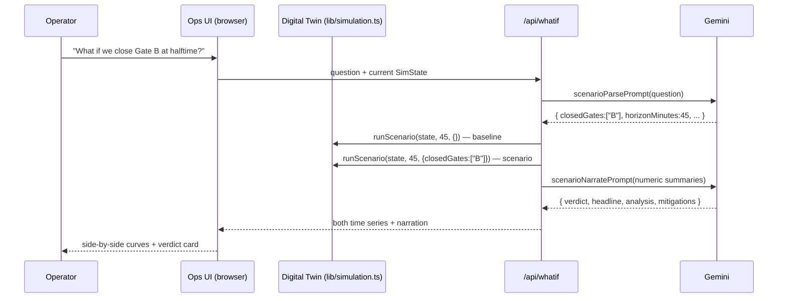

# StadiumIQ — Architecture Notes

## The one-sentence version

A deterministic crowd-simulation engine (the "digital twin") produces live stadium state; Gemini consumes that state through five serverless routes to power grounded fan assistance and agentic operational decision support.

## Data flow

The same pattern — **AI on the language ends, deterministic code in the middle** — repeats across the app. Gemini never fabricates telemetry; it interprets questions and explains computed results.

## The digital twin (`lib/simulation.ts`)

- One tick = one simulated matchday minute; the client advances a tick every 3 s.
- Five phases (ingress → first half → halftime → second half → egress), each with its own flow model: arrival ramps toward kickoff, concourse churn at halftime, gate-constrained drainage at egress.
- **Seeded PRNG (mulberry32)** → identical demo runs, reproducible what-if comparisons, and no `Math.random()` nondeterminism between baseline and scenario.
- `ScenarioParams` (closed gates, held sectors, extra stewards, weather) is the interface the AI targets; `runScenario()` fast-forwards N minutes and reports per-sector utilization series, peak sector, and time-to-clear.
- `stateSummary()` serializes live state to compact text — the grounding context for every ops AI call.

## The agentic pipeline (`/api/ops`, `lib/gemini.ts`)

Three sequential Gemini calls, each with a role prompt and JSON-mode output:

1. **Triage Agent** — input: incident + live state. Output: severity, category, risk factors (must reference live sector data), escalation flag.
2. **Resource Agent** — input: incident + triage JSON + live state + the staff roster from `stadium-data.ts`. Output: unit allocations with counts and ETAs, gate actions, rationale.
3. **Comms Agent** — input: incident + triage + allocations. Output: staff radio message, panic-free public PA text (nullable — the agent may decide public messaging would cause more harm), signage text, tone label.

Chaining structured outputs (rather than one mega-prompt) gives each agent a narrow contract, makes failures isolatable (each stage has a fallback), and lets the UI render the handoff — which is the point: operators need to see *why*, not just *what*.

## Grounding & honesty

- The fan assistant's system prompt embeds `knowledgeBaseText()` — every gate, amenity, accessibility route, and transit option — with an explicit "answer ONLY from this; admit when you don't know" rule.
- Location answers carry a `[MAP:id]` directive; the UI strips it and highlights that gate/sector on the SVG map. The AI's answer and the visual are always in sync because they come from the same token.
- Every route returns `fallback: true` content from the knowledge base when Gemini is unreachable; the UI labels these "offline" instead of failing.

## Frontend

- Next.js 16 App Router, Tailwind v4 (`@theme` tokens), Framer Motion for staged agent reveals and map pulses.
- All graphics are code (SVG stadium bowl, sparkline comparisons) — zero image assets, sub-10 MB repo.
- Accessibility: high-contrast body class, easy-read AI mode, ARIA roles on tabs/controls, `prefers-reduced-motion` support, RTL rendering for Arabic/Persian broadcast cards.
